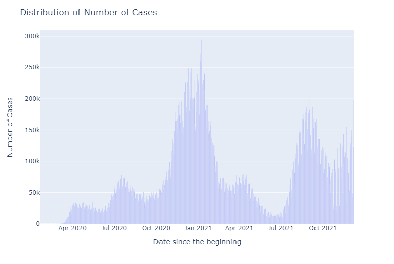
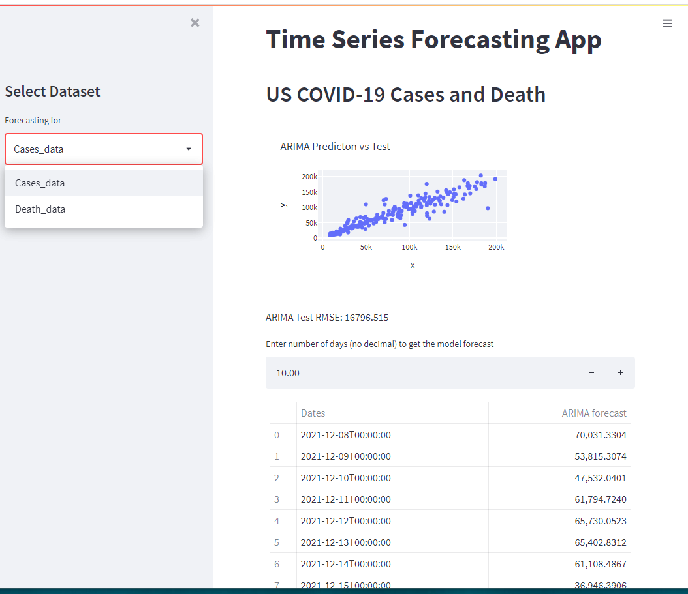

# Time Series analysis and forecasting of COVID -19 Cases in the US

On January 23, 2020 CDC recordss the first U.S. case of COVID-19 in the U.S. in Washington state. Since then the number of caovid-19 cases have been increasing exponentially. CDC and other organisations are reporting number of cases, hospitalizations, and death data on daily basis. After almost a year later, the COVID vaccines are made available to public. As the vaccines are adminsitered, the cases were declining. By the end of summer 2021, the cases were reported low. Again, another strain of COVID-19, came out and the cases started going up as a second cycle. Currently, another form of mutation has evolved and the number of cases are growing. 

Once I observed the datasets, I can clearly see that they are time series records and not linear. I decided to choose the COVID cases data and look their behaviour and attempted to get forecasts using a time series model using machine learning tools in Python.  

The main purpose of this project is to see if the COVID-19 cases data in US can be fitted in any time series regressions. Various time series regressions were used to find the best fit model that can forecast more accurately.

## Data Processing:

Data extraction is performed using data API from the CDC website <https://data.cdc.gov/Case-Surveillance/United-States-COVID-19-Cases-and-Deaths-by-State-o/9mfq-cb36>. The data obatined in JSON format are then converted into Pandas DataFrame in Jupyter Notebook using Python codes. A new dataframe is created usign only necessary variables. The small sized dataset is then exported to MongoDB Altas for web hosting and in order to utilizing later for the web application. 

Using Pandas dataframe, the dataset is then pulled from MongoDB server for preprocessing and analysis. 

## Data Analysis:

The analysis is performed in two stages

    1. Descriptive Analysis: to see how the data look like
    2. Inferential Analysis: to perform depth statistical analysis and draw conclusions. 

### Data Trend

{height = 50%,width=50%}

{height = 50%,width=50%}

Both the cases and death data shows exactly similar trend. Highest number of daily records were in Dec 2020/Jan 2021 and declined to lower in Jun/July 2021. It is obvious that the new mutation COVID-19 delta strain hit after Aug 2021 and again the cases increased. Currently, the cases seem to higher than in last summer which could be the new mutation Omnicorn. 

### Time Series

Time Series is a data series of observations taken at equal time intervals. Analysis of the time series helps to predict future values based on previous observed values. 

Before applying any statistical model on a Time Series data, the series has to be staionary, that means, over different time periods, It should have constant mean and variance and Auto-covariance should not depend on time. Trend and seasionality always make time series non-stationary. One of the technique to check if the series is stationary is Rolling average by ploting the moving average or moving standard deviation. 
Linear Regression:

#### 7 days Rolling Average on Cases and Death

#### Linear Regression on cases

#### Polynomial Regression on cases

#### Support Vector Machine Model on cases

#### Holt's Model on cases

#### Holt's Winter Model on cases

### ARIMA Model: 

Auto Regressive Integrated Moving Average is a combination of two models AR and MA and has three hyperparameters - p(autoregrssive lags), d(order of differentiation), and q(moving average). These parameters are calculated using ACF (Auto Correlation Function) and PACF (partial Auto Correlation Function). Also, exponetional smoothing is a  procedure for making some determination based on prior assumptions such as seasonality.

The hyperparameters for the ARIMA model is then determined as p=10, d=2, and q = 2. This is the best fit model for this dataset with Test RMSE: 15344.664.

#### ARIMA Model on cases

Various Time Series models are tested and their forecasts number of cases are given as in the following table. The predictions are based on the data until December 7th 2021. 

|      Dates | Linear Prediction | Polynomial Prediction | SVM Prediction | Holt's Linear Prediction | Holt's Winter Model Prediction | ARIMA Model Prediction |
|-----------:|------------------:|----------------------:|---------------:|-------------------------:|-------------------------------:|-----------------------:|
| 2021-12-08 |     123922.272105 |         -31521.826055 |  213817.876479 |            565566.797181 |                   71711.461420 |          165637.771452 |
| 2021-12-09 |     124065.533430 |         -40767.520493 |  215321.744045 |            572291.778134 |                   77676.564519 |          161218.507273 |
| 2021-12-10 |     124208.794756 |         -50285.024351 |  216836.596711 |            579016.759087 |                   81833.658279 |          157296.443497 |
| 2021-12-11 |     124352.056081 |         -60078.948236 |  218362.498576 |            585741.740041 |                   33768.467645 |          136196.541707 |
| 2021-12-12 |     124495.317407 |         -70153.950952 |  219899.514019 |            592466.720994 |                   32603.359188 |          108535.231293 |
| 2021-12-13 |     124638.578732 |         -80514.739785 |  221447.707701 |            599191.701947 |                  107978.246685 |          116979.535256 |
| 2021-12-14 |     124781.840058 |         -91166.070806 |  223007.144565 |            605916.682901 |                   85052.609024 |          148487.622094 |
| 2021-12-15 |     124925.101383 |        -102112.749159 |  224577.889835 |            612641.663854 |                   71751.410289 |          157403.159873 |
| 2021-12-16 |     125068.362709 |        -113359.629365 |  226160.009020 |            619366.644807 |                   77716.513388 |          154387.437124 |

From the table above, it can be seen that the optimized ARIMA(10, 0,0) model has better prediction compared to other time series models and hence it is chosen to create a machine learning app.

## Model Deployment:

ARIMA model is then deployed using Streamlit

The deployed model is 
https://share.streamlit.io/tsubedy/final_project/main/app.py

(You may select the dataset and obtain the forcasted values)

Prepared by - T Subedy

